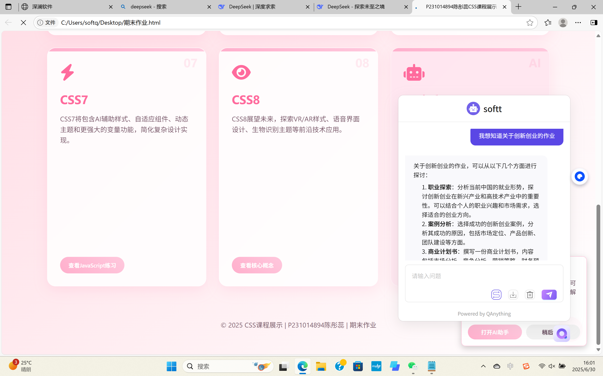
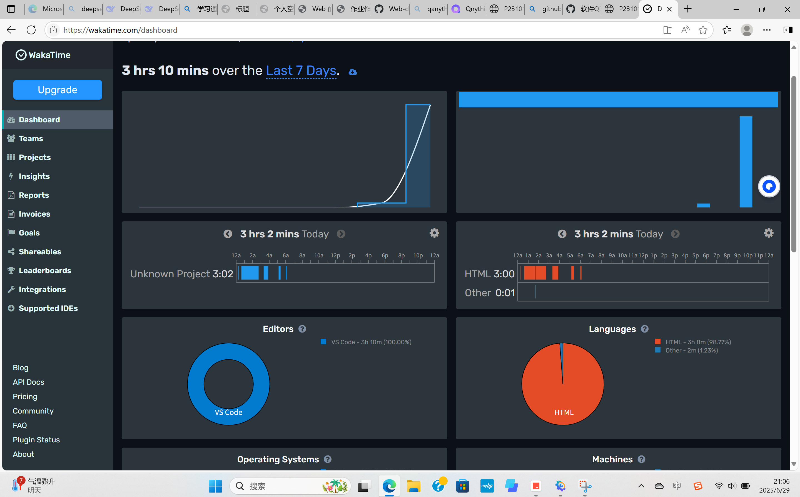
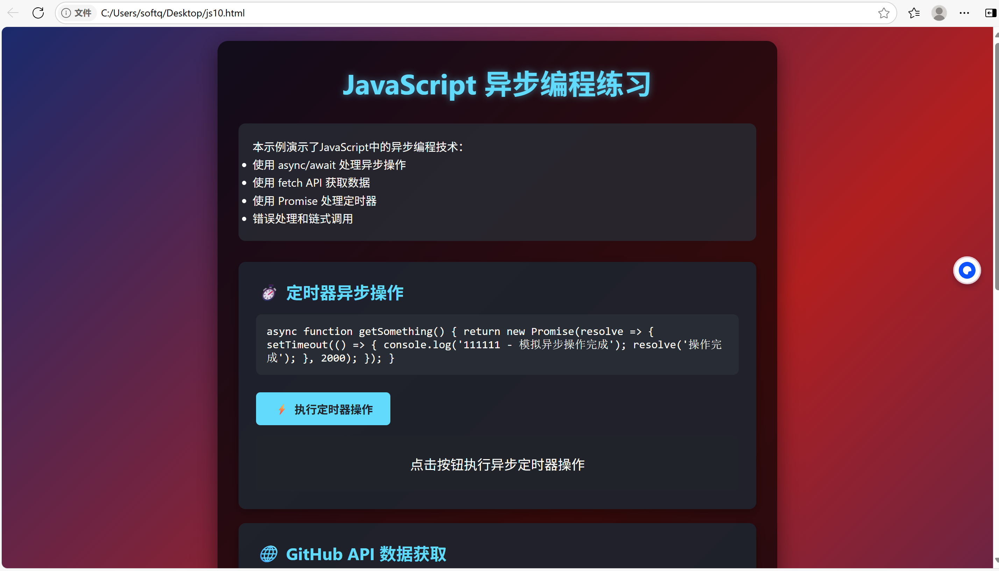

项目简介
这是一个名为"CSS课程展示"的期末作业项目，由"P231014894陈彤蕊"开发。项目通过交互式卡片形式展示CSS 1-8的核心特性，并整合了JavaScript练习和AI助手功能。主要特点包括：

1. 响应式设计：使用CSS Grid/Flexbox实现自适应布局
2. 交互式卡片：8张CSS版本卡片+1张AI助手卡片
3. 模态框系统：点击卡片弹出详细内容展示区
4. AI集成：嵌入有道QAnything助手
5. 旧作业整合：将多个CSS/JS练习整合到模态框中
6. 动态代码执行：实时显示JavaScript代码执行结果

QAnything集成路径与实现细节

集成路径选择：基础路径（iframe嵌入方式）

选择基础路径的原因：

开发效率考量：
避免复杂的API集成和前后端交互
直接复用QAnything提供的完整问答界面
节省UI开发时间（提问输入框、历史记录、答案渲染等）

维护成本低：
自动获得QAnything官方的功能更新
无需处理答案格式化、错误状态等边界情况
内置的对话管理功能开箱即用

视觉一致性：
使用官方提供的图标和交互模式
保持与QAnything其他用户相同的体验
专业设计的响应式界面适配移动端

安全性保障：
通过iframe沙箱隔离运行环境
避免直接处理用户敏感数据
使用官方认证的通信渠道

```html
<script
  src="https://ai.youdao.com/saas/qanything/js/agent-iframe-min.js"
  id="qanything-iframe"
  data-agent-src="https://ai.youdao.com/saas/qanything/#/bots/FC17636AC3764FD4/share"
  data-default-open=false
  data-drag=false
  data-open-icon="https://download.ydstatic.com/ead/icon-qanything-iframe-btn.png"
  data-close-icon="https://download.ydstatic.com/ead/icon-qanything-iframe-btn.png"
  defer
></script>
```

实现细节：
1. 浮动按钮触发：
   ```javascript
   // 打开AI助手函数
   window.openAIAssistant = function() {
     if (window.QAnythingIframe && typeof window.QAnythingIframe.open === 'function') {
       window.QAnythingIframe.open();
     }
   }
   ```
   
2. 加载检测：
   ```javascript
   function checkAIAssistantLoaded() {
     if (window.QAnythingIframe) {
       setTimeout(showAINotice, 2000); // 显示提示
     } else {
       setTimeout(checkAIAssistantLoaded, 500); // 轮询检测
     }
   }
   ```

3. 用户引导：
   ```html
   <!-- AI提示框 -->
   <div class="ai-assistant-notice">
     <h3><i class="fas fa-robot"></i> AI助手已激活</h3>
     <button onclick="openAIAssistant()">打开AI助手</button>
   </div>
   
   <!-- 浮动按钮 -->
   <div class="ai-assistant-float" onclick="openAIAssistant()">
     <i class="fas fa-robot"></i>
   </div>
   ```

选择原因：
1. 官方SDK：使用有道官方iframe嵌入方案，确保稳定性
2. 按需加载：`data-default-open=false`避免干扰主界面
3. 渐进式引导：通过浮动按钮和提示框引导用户发现功能
4. 异步检测：轮询检测SDK加载状态，提供无缝体验

 WakaTime API集成方法


项目结构
```
期末作业.html
├── HEAD
│   ├── 元数据 (charset/viewport)
│   ├── FontAwesome CDN
│   └── 内联CSS (1500+行样式)
├── BODY
│   ├── 头部 (标题/副标题)
│   ├── 主内容区 (9张卡片)
│   ├── 8个模态框 (CSS1-8内容)
│   ├── 页脚
│   ├── AI浮动按钮
│   └── AI提示框
└── SCRIPTS
    ├── 模态框管理系统
    ├── JS代码执行器 (3个练习)
    ├── AI助手控制器
    └── QAnything SDK
```

 CSS卡片中的旧作业整合方式

1. 模态框容器：
   ```html
   <div id="css1-modal" class="modal">
     <div class="modal-content">
       <div class="css-exercise">旧作业内容</div>
     </div>
   </div>
   ```

2. 内容重组：
   - CSS1：基础语法练习
   - CSS2：样式表应用
   - CSS3：定位演示
   - CSS4：盒模型/布局
   - CSS5：JS基础语法
   - CSS6：JS类与对象
   - CSS7：JS DOM操作
   - CSS8：核心概念总结

3. 样式重写：
   ```css
   .css-exercise h1 {
     font-size: 2.2rem;
     color: darkblue;
     /* 覆盖主样式 */
   }
   
   .position-demo .relative {
     position: relative;
     top: 150px; /* 定位示例 */
   }
   ```

4. 动态执行：
   ```javascript
   function executeJavaScriptExercise3() {
     const outputArea = document.getElementById('js-exercise-output');
     // 捕获console输出
     console.log = function(message) {
       outputArea.innerHTML += `> ${message}<br>`;
     };
     // 执行旧作业代码
     class Student { /* ... */ }
   }
   ```

项目运行指南

1. 直接运行：
   ```bash
   # 无需安装依赖
   双击打开HTML文件
   ```

2. 核心交互：
   - 点击1-8号卡片查看CSS特性
   - 点击AI卡片/浮动按钮唤醒助手
   - 模态框内可执行JS代码
   - ESC键关闭弹窗

3. 开发建议：
   ```bash
   # 使用Live Server扩展（VSCode）
   npm install -g live-server
   live-server --port=3000
   ```

4. 定制选项：
   - 修改`data-agent-src`替换AI知识库
   - 调整卡片内容`<div class="card">`
   - 更新JS练习代码在对应的`executeJavaScriptExercise*`

5.*响应式测试：
   - 使用Chrome设备模式
   - 测试断点：480px/768px

> 注意事项：AI功能需要联网加载有道资源，部分JS练习需要现代浏览器支持ES6类语法



